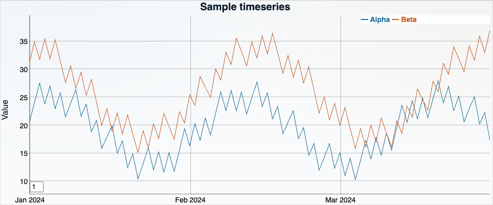
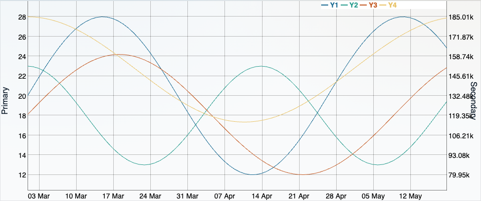
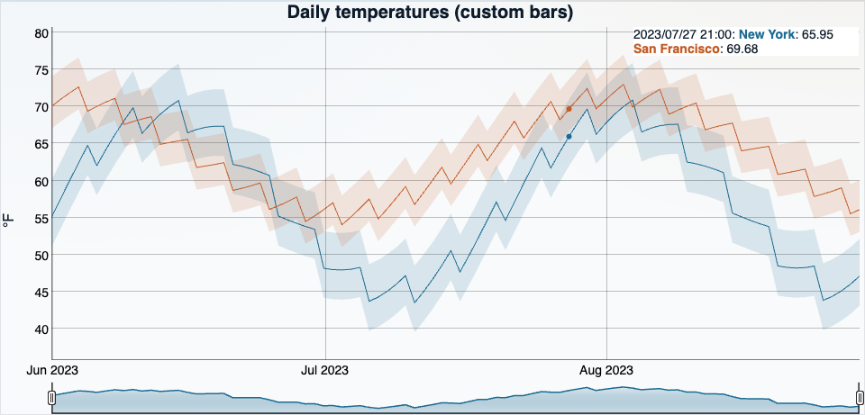
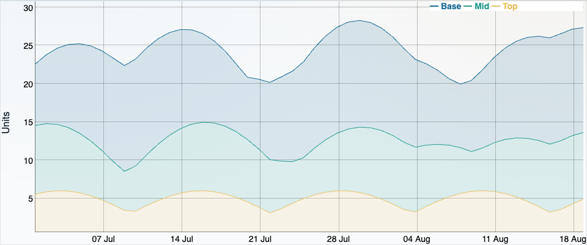
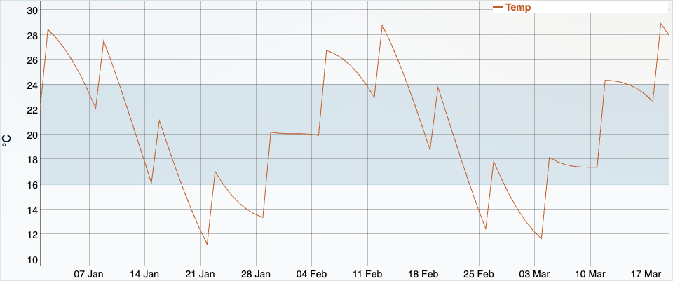
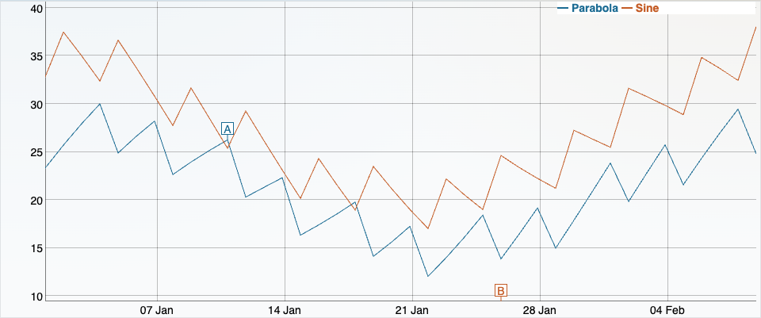
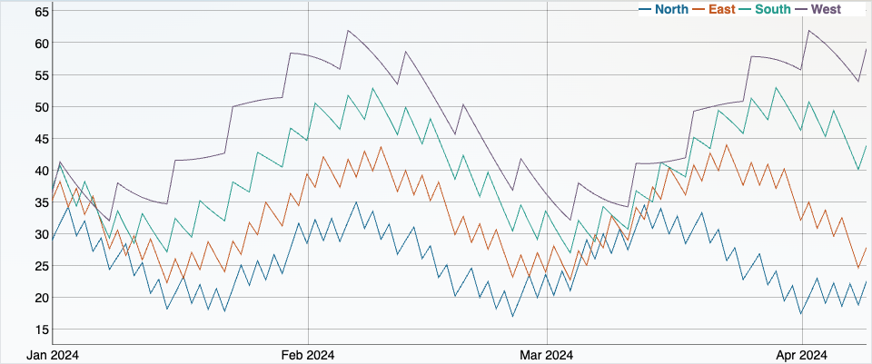
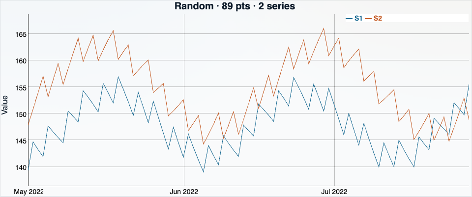
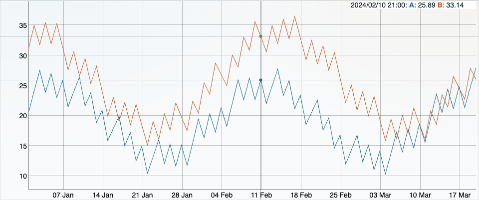
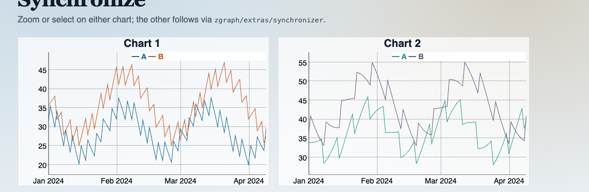

# Zgraph

<p align="center">
  <strong>Fast, typed, interactive timeseries charts for the modern web.</strong><br />
  Spiritual successor to <a href="https://github.com/danvk/dygraphs">dygraphs</a> — same DNA, TypeScript core, ESM/CJS/IIFE builds.
</p>

<p align="center">
  <a href="https://www.npmjs.com/package/zpgraph"></a>
  
  
</p>

<p align="center">
  
</p>

Published on npm as **[`zpgraph`](https://www.npmjs.com/package/zpgraph)**
(the bare name `zgraph` is already taken).

---

## Why Zgraph?

Dygraphs proved that a lean canvas chart can feel instant on dense data.
Zgraph keeps that interaction model and rebuilds the stack for today:

- **TypeScript end-to-end** — `ZgraphOptions`, `Point`, plugins and callbacks are
  typed. A typo in an option name is a compile error, not a silent noop.
- **Modern package surface** — ESM + CJS + browser IIFE, separate CSS import,
  optional extras under `zpgraph/extras/*`.
- **Interaction that scales** — drag-zoom, pan, animated zooms, range selector,
  keyboard selection, Shift+arrows for pan/zoom.
- **Large series friendly** — min-max decimation before layout, while selection
  APIs still index the full raw data.
- **CSP-aware defaults** — built-in UI styles via CSSOM; prefer
  `DocumentFragment` formatters under strict CSP.
- **Familiar if you know dygraphs** — `updateOptions`, `xAxisRange`,
  `resetZoom`, annotations, dual axes… renamed, not reinvented.

---

## Install

```bash
npm install zpgraph
```

```ts
import Zgraph from 'zpgraph';
import 'zpgraph/style.css';

const g = new Zgraph('chart', data, {
  labels: ['Date', 'Alpha', 'Beta'],
  legend: 'always',
  animatedZooms: true,
});
```

Stylesheet is a **separate** import on purpose: a CSS side-effect in the package
entry would break plain Node and SSR.

Browser IIFE (CSS injected by the script):

```html
<script src="node_modules/zpgraph/dist/zgraph.min.global.js"></script>
```

---

## Gallery

Screenshots from the live demos. Run them yourself with
`npm run build && npx serve .` → open [`/demos/`](demos/).

<table>
  <tr>
    <td width="50%">
      
      <p><b>Two y-axes</b> — independent scales for mixed magnitudes.</p>
    </td>
    <td width="50%">
      
      <p><b>Range selector</b> — minimap + custom high/low bars.</p>
    </td>
  </tr>
  <tr>
    <td width="50%">
      
      <p><b>Stacked fill</b> — area stacks with fill under the curve.</p>
    </td>
    <td width="50%">
      
      <p><b>Underlay</b> — paint bands behind series with <code>underlayCallback</code>.</p>
    </td>
  </tr>
  <tr>
    <td width="50%">
      
      <p><b>Annotations</b> — markers on points; click to add more.</p>
    </td>
    <td width="50%">
      
      <p><b>Highlight series</b> — emphasize the hovered series.</p>
    </td>
  </tr>
  <tr>
    <td width="50%">
      
      <p><b>Random dataset</b> — swap the entire <code>file</code> on a button click.</p>
    </td>
    <td width="50%">
      
      <p><b>Crosshair</b> — extra plugin for selection crosshairs.</p>
    </td>
  </tr>
</table>

<p align="center">
  
  <br />
  <b>Synchronize</b> — linked zoom and selection across charts
  (<code>zpgraph/extras/synchronizer</code>).
</p>

### More demos

The [`demos/`](demos/) folder also includes:

- Live **dynamic update** (append a point every second)
- **Error bars** (`[value, stddev]`)
- **Per-series** stroke / points / fill
- Gallery index with one-click links to every example

---

## Typed by default

Zgraph ships with declaration files. Options are a closed interface — no
`[key: string]: any` escape hatch — so editors catch mistakes early:

```ts
import Zgraph, { type ZgraphOptions } from 'zpgraph';

const opts = {
  labels: ['x', 'A'],
  legend: 'always',
  underlayCallback: (ctx, area, g) => {
    // `g` is typed as Zgraph
    const y = g.toDomYCoord(20);
  },
} satisfies ZgraphOptions;

new Zgraph(el, data, opts);
```

`typescript/no-explicit-any` is enforced on library sources. You get IntelliSense
for series options, axes, plugins and the public chart API.

---

## Features at a glance

| Area            | What you get                                                                 |
| --------------- | ---------------------------------------------------------------------------- |
| Data            | Arrays, CSV strings, async `file` via `fetch`, custom data handlers          |
| Series          | Multi-series, stacked, fill, error/custom bars, per-series styles            |
| Axes            | Dual y-axes, log scales, tickers, formatters                                 |
| Interaction     | Zoom, pan, range selector, touch, keyboard, synchronized charts              |
| Overlay         | Annotations, underlay/draw callbacks, hairlines / super-annotations extras   |
| Accessibility   | `role="img"`, live legend region, focusable chart, Shift+arrows pan/zoom     |
| Packaging       | ESM / CJS / IIFE, tree-shakeable extras, injectable `setLogger`              |

---

## Package surface

| Export                | Purpose                                   |
| --------------------- | ----------------------------------------- |
| `zpgraph`           | Chart class, plugins, types, `utils`, `tickers` |
| `zpgraph/style.css` | Chart CSS (explicit import)               |
| `zpgraph/extras/*`  | Optional plugins (crosshair, synchronizer, …) |

`utils` is a documented subset (stroke patterns, shapes, default formatters).
Internals such as `toRGB_` are not part of the public surface.

---

## Content Security Policy

Built-in plugins style through the CSSOM, so they work under
`style-src 'self'` without `unsafe-inline`.

Prefer `legendFormatter` returning a `DocumentFragment` or `Node`. A **string**
return is treated as trusted application HTML (may need `unsafe-inline` for
that path). User templates for extras (`#hairline-template`, …) belong to the
page.

---

## Migrating from dygraphs

| dygraphs                    | Zgraph                          |
| --------------------------- | ------------------------------- |
| `import … from 'dygraphs'`  | `import … from 'zpgraph'`     |
| `new Dygraph(...)`          | `new Zgraph(...)`               |
| `dygraph.css`               | `zpgraph/style.css`           |
| Classes `dygraph-*`         | `zgraph-*`                      |
| Event prop `e.dygraph`      | `e.zgraph`                      |

API shape is familiar; **compatibility is not guaranteed**. Prefer
`ZgraphOptions` and re-test interactions after migrate.

---

## Development

```bash
npm install
npm test
npm run typecheck
npm run lint
npm run build
npx serve .   # → /demos/
```

Vanilla library first. Framework wrappers will live as sibling packages later.

## License

MIT — [LICENSE](LICENSE). Dygraphs attribution in [NOTICE](NOTICE).
